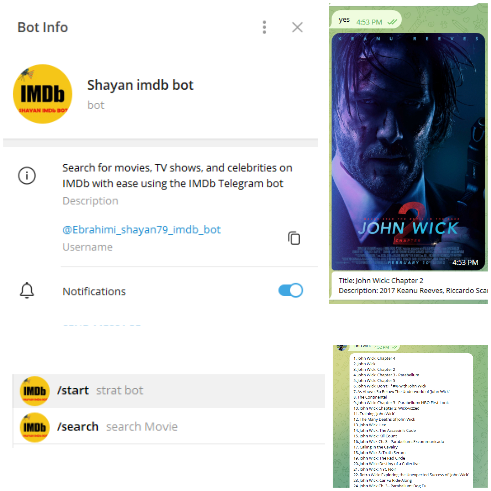
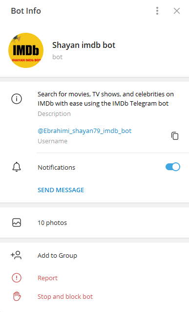
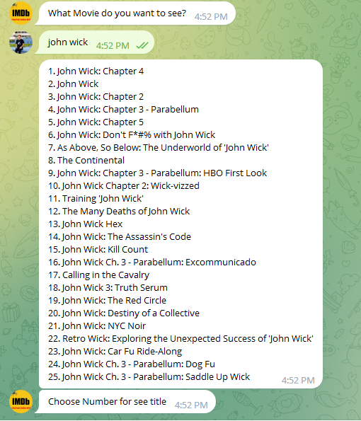

# IMDB-Telgram-Bot





## For strat
> open BotFather in telegram
use 
```
/start
/newbot
/setprivacy
```
to start first setting of the bot
- copy the token
- make keys.py
- insert token
-and write function

> **Note**
> This is a note

> **Warning**
> This is a warning

| :exclamation: TypeError: Updater.__init__() got an unexpected keyword argument 'use_context |
|-----------------------------------------|


| :white_check_mark: "pip install python-telegram-bot==13.7" |
|-----------------------------------------|

`Updater` is a class whose responsibility it is to fetch updates from Telegram, either via get_updates or via a webhook

`Dispatcher` is a class whose responsibility it is to do something with the updates. This is done through the Handlers as explained in the docs of [Dispatcher.add_handler](https://docs.python-telegram-bot.org/en/stable/telegram.ext.dispatcher.html#telegram.ext.Dispatcher.add_handler). It also manages in-memory dictionaries that can be used to store bot/chat/user related data
